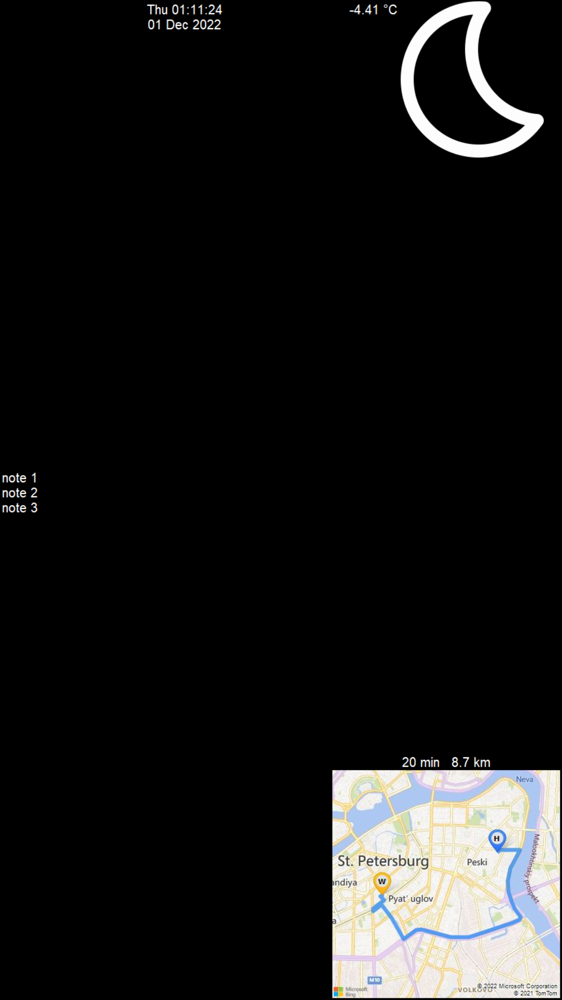

# SmartMirror

SmartMirror is a simple app that displays time and date, weather, traffic, trip duration between two points, and memos. Necessary to have API keys for openweather.org and bing maps, also simplenote account. A screen must be mounted behind a two-way mirror for the effect. Works under economic sanctions.

## Configuration

- Change variables in **variables.py** accordingly.
- Install required dependencies e.g.
  - pip install pillow
  - pip install simplenote

-----------

-----------

### License

GNU GPL
